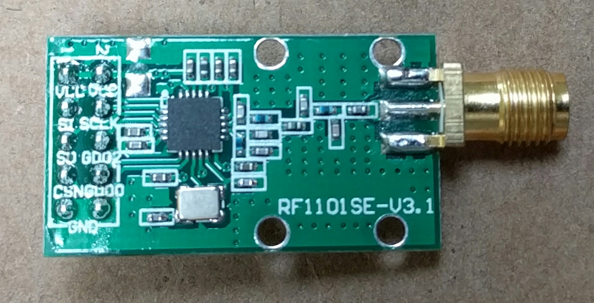
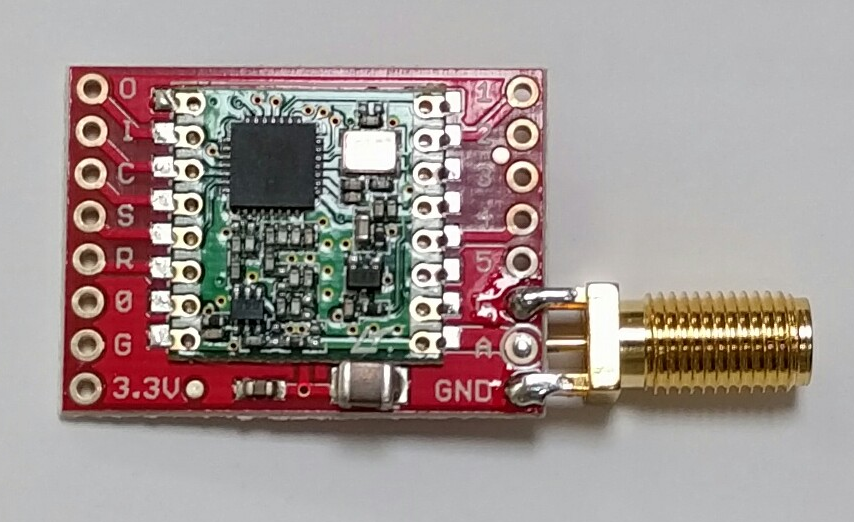

# medtronic

The top level `medtronic` package provides a unified API for
communicating with Medtronic insulin pumps using SPI-connected radio
modules.

Documentation: <https://godoc.org/github.com/ecc1/medtronic>

This package provides high-level functions like `GlucoseTargets` and `SetTempBasal`
and is intended as the primary API for applications.

Decoding of messages to and from the pump is derived almost entirely from
[Ben West's pioneering "Decoding Carelink" work.](https://github.com/bewest/decoding-carelink)

# medtronic/radio

The `medtronic/radio` package provides a Go interface to
the SPI-attached radio hardware.

The following two types of radio hardware are currently supported.

**Note that an antenna must be attached before using either module.**

# medtronic/cc1101

A CC1101 module designed for 915MHz
is [available here.](http://www.elechouse.com/elechouse/index.php?main_page=product_info&products_id=2148)

This module comes with a 26MHz crystal, which must be changed to a 24MHz crystal
by following [these instructions.](https://github.com/ps2/rileylink/wiki/Upgrading-to-a-24MHz-crystal)

# medtronic/rfm69

An RFM69HCW module on a convenient breakout board
is [available here](https://www.adafruit.com/products/3070)
[or here.](https://www.sparkfun.com/products/12775)

An [edge-mounted female SMA connector](https://www.amazon.com/gp/product/B006Z95LVI)
can be attached conveniently.

# medtronic/apps

This directory contains a number of command-line applications,
including a "Swiss army knife" application `mdt`
(analogous to the the `openaps use pump ...` commands).

# spilink backend for mmeowlink

The `spilink` directory contains a backend server that can be used with
[a proof-of-concept mmeowlink driver](https://github.com/ecc1/mmeowlink/tree/spilink)
for [openaps.](https://openaps.org)
